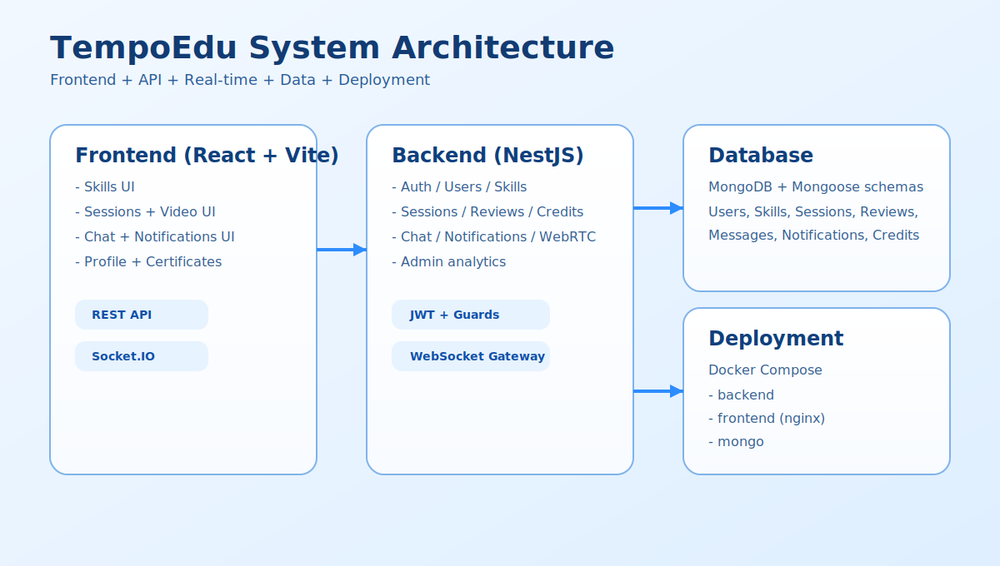
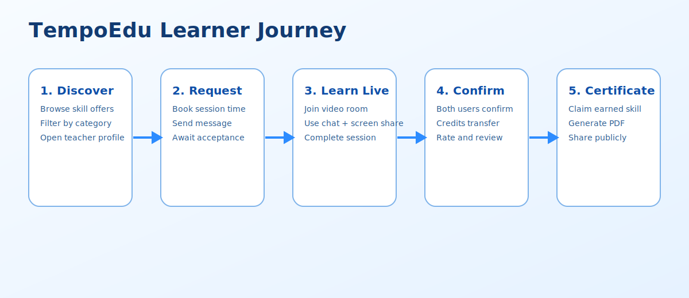
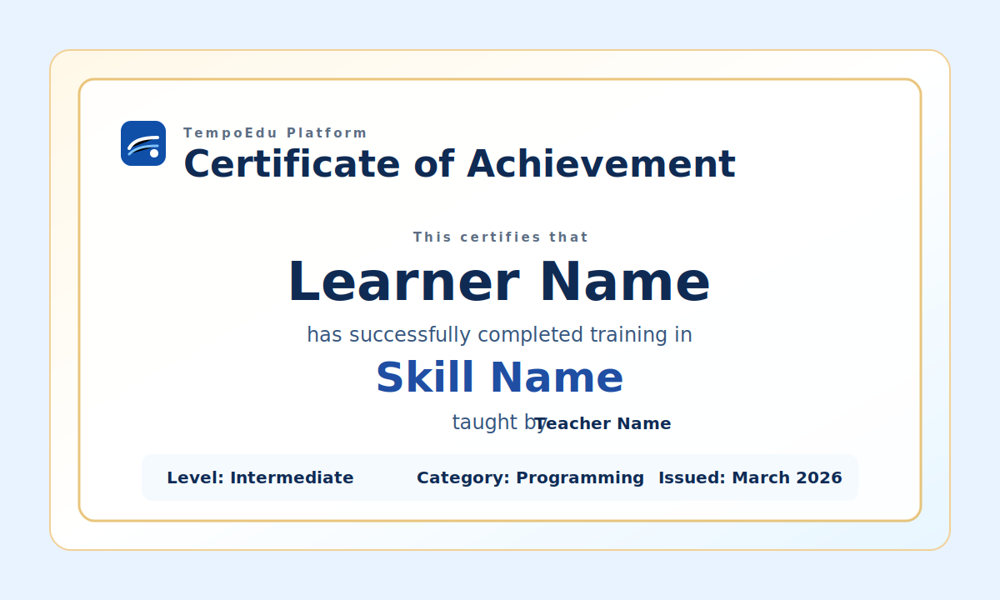

# TempoEdu

TempoEdu is a full-stack peer-to-peer learning platform where users teach and learn skills through live sessions, chat, credits, reviews, and certificates.

## Platform Highlights

- Skill marketplace: publish skills to offer or request.
- Session lifecycle: request, accept, reject, cancel, complete.
- Live communication: real-time chat and WebRTC video calls.
- Credits economy: controlled credit transfer per completed session.
- Reviews and reputation: build trust with feedback and ratings.
- Earned skills and certificates: claim public achievements and export certificates as PDF.
- Admin tools: monitor platform usage and manage users.

## Tech Stack

### Backend
- NestJS
- MongoDB + Mongoose
- Socket.IO
- JWT authentication
- Jest unit testing

### Frontend
- React + TypeScript
- Vite
- Tailwind CSS
- Socket.IO client

### Deployment
- Docker + Docker Compose

## Demonstrative Pictures

### 1) Platform Architecture


### 2) User Learning Flow


### 3) Certificate Preview Concept


## Core User Journey

1. A user creates or discovers skills.
2. A learner requests a session with a teacher.
3. Teacher accepts and a live room is generated.
4. Users communicate through chat and video.
5. On completion, credits are transferred.
6. Learner claims the earned skill and generates a branded certificate PDF.

## Project Structure

```text
TempoEdu/
  TempoEdu-backend/   # NestJS API, websocket gateways, data models, tests
  TempoEdu-frontend/  # React app, pages, services, UI components
  docs/images/        # Public project visuals used in README
```

## Quick Start

### Run with Docker

```bash
cd TempoEdu-backend
docker compose build
docker compose up -d
```

### Run locally

```bash
# backend
cd TempoEdu-backend
npm install
npm run start:dev

# frontend
cd ../TempoEdu-frontend
npm install
npm run dev
```

## Tests

```bash
cd TempoEdu-backend
npm run test
```

## Author

Built by the TempoEdu team.
